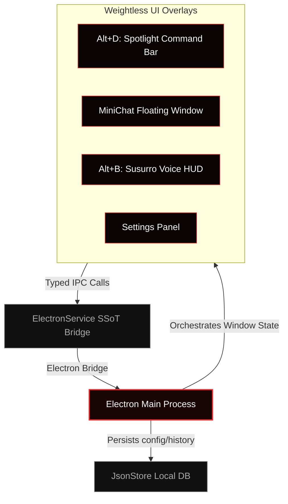

# 🌋 Hades Desktop AI Agent

<p align="center">
  
</p>

<p align="center">
  <strong>A weightless, ultra-fast, spatial desktop AI assistant built on Electron, React, and Google Gemini.</strong>
</p>

<p align="center">
  
  
  
  
</p>

---

## ⚡ Concept & Design Philosophy

**Hades** is not a conventional flat web-app-in-a-box. It is designed around the principles of **Antigravity Design**—creating a weightless, highly spatial, and layered user interface that feels alive.

*   **🪶 Weightlessness:** Floating cards, transparent backdrops, and soft diffused shadows (`box-shadow: 0 20px 40px rgba(0,0,0,0.5)`) create a glassy, premium feel.
*   **🔮 Glassmorphism:** Subtle translucency using `backdrop-filter: blur(16px)` combined with ultra-thin semi-transparent borders for high-end contrast.
*   **🩸 Continuous Gradients & Retro Aesthetics:** Visual palettes rely on harmonious HSL crimson-to-dark-underworld gradients, paired with retro-arcade typography (`Press Start 2P`) for a distinct sci-fi aesthetic.
*   **🕹️ Dynamic Smoothness:** State changes (hovers, focus states, activations) never snap. They utilize smooth transitions (`0.3s cubic-bezier(0.16, 1, 0.3, 1)`) to offload GPU rendering via `will-change`.

---

## 📦 Spatial Architecture

Hades manages multiple independent, transparent, and floating renderer windows coordinated by a robust backend. Here is how the spatial systems align:



---

## ✨ Key Features

*   **🎙️ Susurro (Voice Assistant):** Activated via `Alt+B`, this module performs real-time speech-to-text utilizing Gemini Flash. It streams microphone and system audio, delivering modular, context-aware suggestions directly onto your viewport.
*   **💬 MiniChat Overlay:** A lightweight, non-intrusive floating canvas. Perfect for coding guidance, quick reviews, and prompt testing without breaking your current workflow.
*   **⌨️ Spotlight Command Bar (`Alt+D`):** A beautiful, centralized search launcher. Takes raw inputs, queries Tavily for live web intelligence, and displays gorgeous, formatted markdown results.
*   **🕶️ Screen-Recording Stealth Mode:** Utilizing hardware-level window protection (`setContentProtection`), Hades is completely invisible to screen captures, recorders, and streaming tools—keeping your credentials and private codes fully secure.
*   **🎭 Local Persona Management:** Dynamically create, configure, and save customized AI personas with specific system prompts, saved in a persistent JSON database.

---

## 🛠️ Installation & Setup

### Prerequisites

*   Node.js (v18.x or later)
*   npm or yarn

### 1. Installation

Clone the repository and install the dependencies:

```bash
git clone https://github.com/victorl-dev/Hades-Agent.git
cd Hades-Agent
npm install
```

### 2. Configure API Keys

Hades utilizes Google Gemini and Tavily Search APIs.

1. Copy the environment configuration template:
   ```bash
   cp .env.example .env
   ```
2. Open `.env` and fill in your credentials:
   ```env
   VITE_GEMINI_API_KEY=your_gemini_api_key_here
   VITE_TAVILY_API_KEY=your_tavily_api_key_here
   ```
   *(Note: The `.env` file is protected locally and ignored by Git to prevent exposure).*

### 3. Run in Development Mode

Run the React frontend build and launch the Electron application concurrently:

```bash
npm run dev
```

### 4. Build for Production

Compile your production-ready client bundles using Vite:

```bash
npm run build
```

---

## ⌨️ Hotkeys

| Shortcut | Action | Destination |
| :--- | :--- | :--- |
| `Alt+D` | Toggle Spotlight Launcher | **Command Bar** |
| `Alt+B` | Open / Start Real-time Speech-to-Text | **Susurro Voice HUD** |
| `Esc` | Stop Recording / Hide active UI | **All Panels** |

---

## 🛡️ License

This project is licensed under the **ISC License**. Developed with passion by [victorl-dev](https://github.com/victorl-dev).
