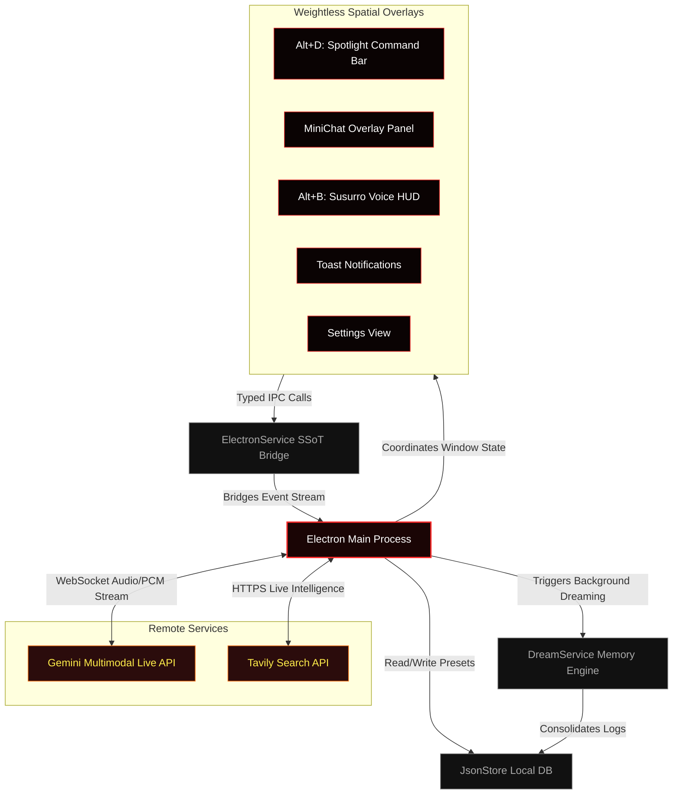

# 🌋 Hades Desktop AI Agent

<p align="center">
  
</p>

<h2 align="center">🔮 The Antigravity AI Companion</h2>

<p align="center">
  <strong>A weightless, spatial desktop AI companion engineered with Electron, React, and Google's Gemini Multimodal Live API. Featuring real-time voice streaming, background dreaming mechanics, and strict hardware-level privacy.</strong>
</p>

<p align="center">
  
  
  
  
  
</p>

---

## ⚡ Concept & Design Philosophy

**Hades** is built from the ground up to break away from flat, browser-bound AI chats. Inspired by the **Antigravity Design System**, it creates a weightless overlay interface that feels native, premium, and alive on your OS desktop.

```
┌────────────────────────────────────────────────────────┐
│  🌌 ANTIGRAVITY UI SPECS                              │
├────────────────────────────────────────────────────────┤
│  🪶 Weightlessness: Soft shadows & float components   │
│  🔮 Translucency: backdrop-filter: blur(16px)          │
│  🩸 Color Palette: Harmonious HSL crimson gradients     │
│  🕹️ Dynamics: cubic-bezier(0.16, 1, 0.3, 1) transitions │
└────────────────────────────────────────────────────────┘
```

> [!TIP]
> **Stealth Shield Active:** Running hardware-level screen protection makes Hades completely invisible to capture cards, Discord streams, OBS, and screen recorders—safeguarding your terminal context, API keys, and workspace private data.

---

## 🚀 Key Architectural Features

### 1. 🎙️ Susurro Voice HUD (`Alt+B`)
Our crown jewel feature. Susurro captures real-time high-fidelity microphone or system audio at **16kHz raw PCM** and pipes it directly through WebSockets to the **Gemini Multimodal Live API** (`models/gemini-2.5-flash-native-audio-latest`).
*   **⚡ Ultra-Low Latency:** Instant voice-to-text transcriptions rendered inside a gorgeous HUD overlay.
*   **🌍 Universal Translation:** Automatic on-the-fly translation layer utilizing specialized background workers to adapt outputs into multiple languages of your choice.
*   **📊 Session Telemetry:** Continuous display tracking session timers, active pinned modes, and total input/output token expenses per session.

### 2. 🧠 DreamService (Long-Term Memory Loop)
When Hades goes idle or 10 seconds after application boot, it enters a background **Dreaming Cycle**.
*   **💤 Analysis Mode:** Gathers accumulated logs of conversation streams and tool usages.
*   **🎨 Memory Consolidation:** Leverages Gemini to synthesize logs, extracting behavioral insights, recurring user preferences, and custom developer shortcuts.
*   **💾 SSoT Storage:** Consolidates insights into local persistent memory (`.Hades/memory/learnings.json`) which feeds back into active sessions to provide contextual awareness.

### 3. 🛡️ OS-Level Stealth Mode
Designed for high-security enterprise and streaming environments.
*   Uses Chromium's low-level windows composite masking (`setContentProtection`) to prevent screen-capturing software from reading the application window contents.
*   Ideal for developers coding on stream who want an AI companion without leaking sensitive lines of code or private environment setups.

### 4. ⌨️ Spotlight Command Bar (`Alt+D`)
A spatial command bar overlay built for absolute efficiency.
*   Takes immediate keyboard inputs and routes them to a specialized hybrid worker.
*   Integrates the **Tavily Search API** to fetch live web intelligence, compiling facts and real-time answers directly on your screen in beautifully structured Markdown.

### 5. 🕒 TaskService & Alert Engine
A lightweight, background daemon monitoring schedules.
*   Checks every 30 seconds for due tasks stored locally.
*   Spawns independent, non-intrusive floating transparent Notification Windows on top of other applications.

---

## 📦 Spatial System Flowchart

Here is the underlying micro-architecture illustrating the interplay of renderer window overlays, the Electron main process, local stores, and remote AI APIs:



---

## 🛠️ Installation & Setup

### Prerequisites

Ensure you have the following installed locally:
*   [Node.js](https://nodejs.org/) (v18.x or newer)
*   [npm](https://www.npmjs.com/) or [yarn](https://yarnpkg.com/)

### 1. Repository Setup

```bash
# Clone the repository
git clone https://github.com/victorl-dev/Hades-Agent.git

# Move into root
cd Hades-Agent

# Install all workspace dependencies
npm install
```

### 2. Environment Configuration

1. Initialize your local configuration file from the template:
   ```bash
   cp .env.example .env
   ```
2. Populate the `.env` file with your authorized access keys:
   ```env
   VITE_GEMINI_API_KEY=your_gemini_api_key_here
   VITE_TAVILY_API_KEY=your_tavily_api_key_here
   ```
   *(Note: The `.env` file is heavily protected and ignored globally by Git).*

### 3. Launch Development Environment

Run the React HMR dev server and spawn the Electron main runtime concurrently:

```bash
npm run dev
```

### 4. Compile Production Builds

Build and compile the optimized client distribution package:

```bash
npm run build
```

---

## ⌨️ Desktop Hotkeys

Hades remains invisible in your background tray and can be instantly summoned using universal global shortcuts:

*   **`Alt+D`**: Toggle Spotlight Command Launcher.
*   **`Alt+B`**: Open / Toggle real-time audio voice transcription in **Susurro Voice HUD**.
*   **`Esc`**: Instantly stop audio recordings, collapse panels, and return window focus to your active code editor.

---

## 🛡️ License & Credits

Licensed under the **ISC License**. Created and maintained by [victorl-dev](https://github.com/victorl-dev). Developed for next-level productivity and seamless desktop integration.
